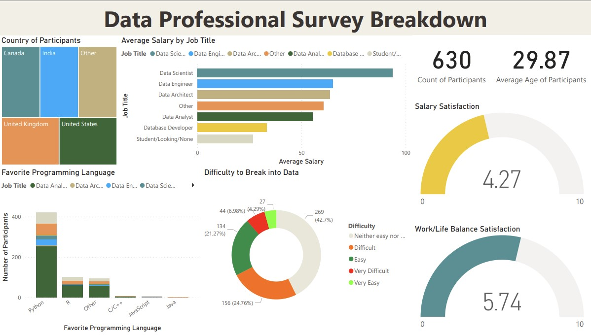

# Data Analytics Landscape Visualization

[Fullscreen View](https://raw.githubusercontent.com/ataunque/developer_survey_dashboard/main/github_survery_dashboard.jpg)
## Project Description

This project provides a comprehensive analysis, using **Power BI**, of the latest trends and insights in the field of data analytics. This analysis is based on [data collected from a survey](https://github.com/AlexTheAnalyst/Power-BI/blob/main/Power%20BI%20-%20Final%20Project.xlsx) conducted by data analytics influencer, Alext the Analyst, among his followers. The project's goal is to offer a detailed understanding of the evolving landscape of data analytics, as perceived by professionals and enthusiasts in the field.

## Business Case

The project serves several key objectives and business cases, including:

1. **Understanding Industry Trends:** Analyzing responses to identify emerging trends, preferred programming languages, and job satisfaction levels within the data analytics field.

2. **Career Transition Insights:** Exploring data on career transitions into data analytics, shedding light on the challenges and experiences of those who made the switch.

3. **Salary Analysis:** Providing salary insights based on factors such as job roles, industry, and location, aiding professionals in benchmarking their compensation.

4. **Demographic Exploration:** Examining demographics, including gender, age, education, and ethnicity, to promote diversity and inclusion in the data analytics industry.
---
Project By: Amolvir Taunque